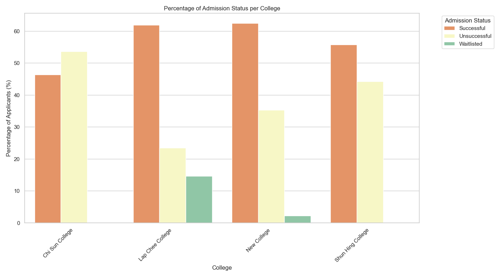
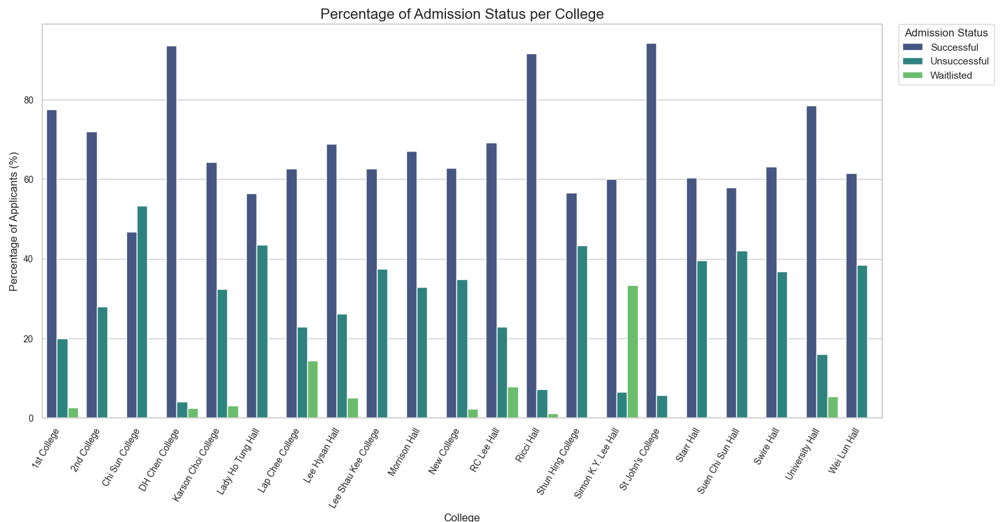
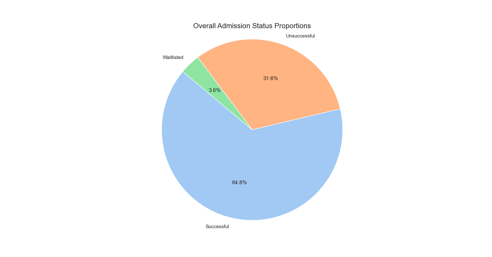
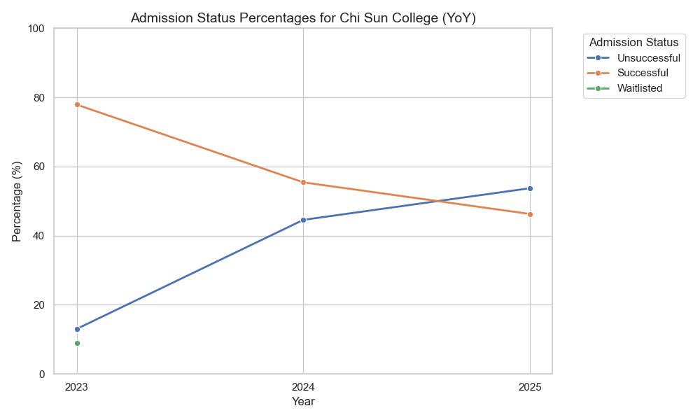
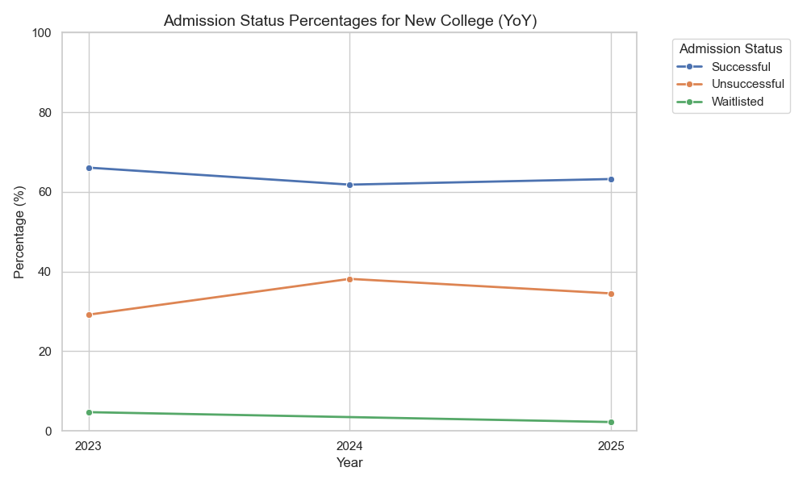
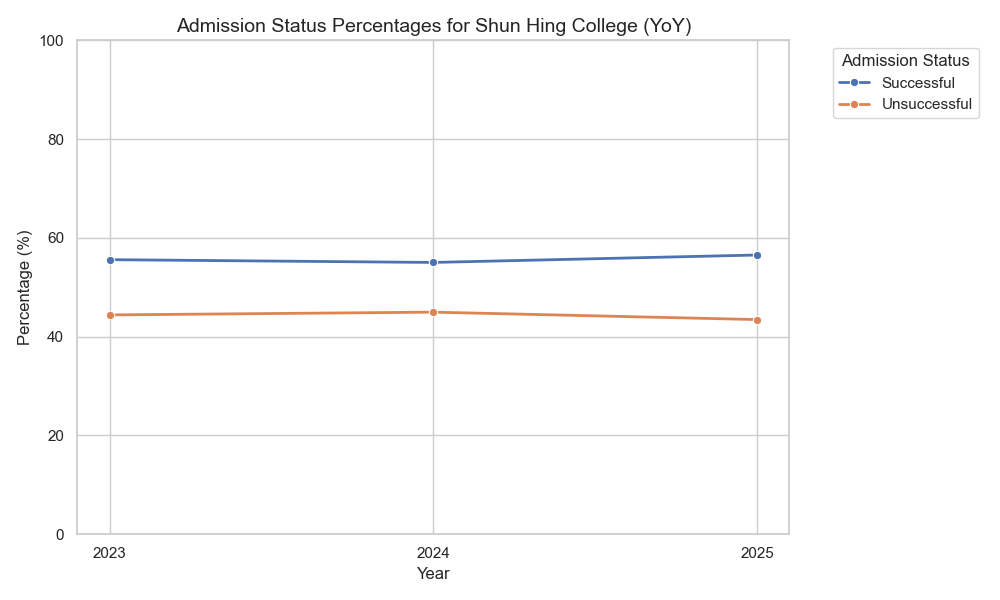
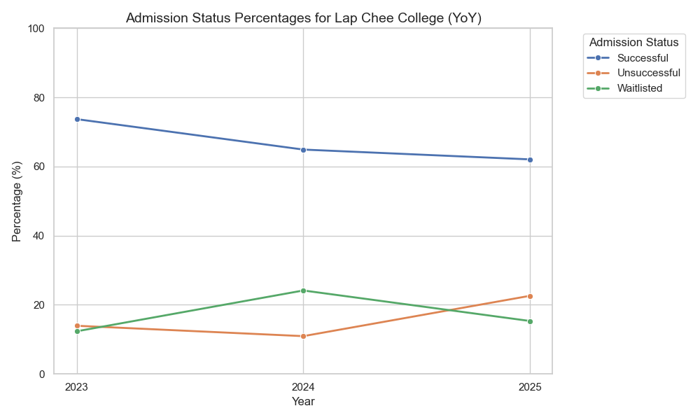
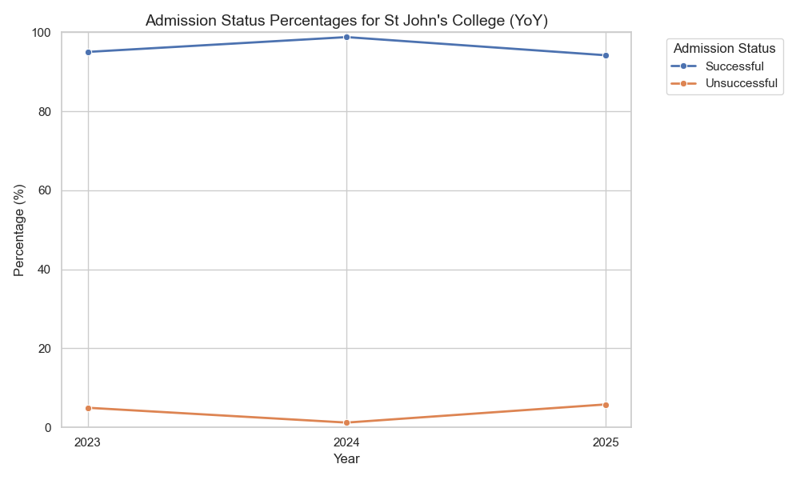

# HKU Hall & College 1st Round Readmission Analysis

A small visualization of hall&college readmission rate in HKU. Manually extracting data from unstructured PDF documents is time-consuming and error-prone. This project automates the process and provides reusable extraction templates.
## Description:
- Data from 21 PDF files are structured into similar templates (supports multiple PDF layouts), then processed through PDFplumber to extract IDs, College, Admission Status, and (Room Type, degree, student status) if available. 
- Data is stored in a .db file using sqlite3, which is suitable for small - medium applications.
- Visualization and analysis using pandas to identify key trends.
## Key Findings:
**2025 (latest):**
- Chi Sun and Shun Hing as expected are very competitive; CS accepts 1st round only around 46% of applicants, while Shun Hing accepts around 55%.
- By comparison, Lap Chee and New College accepted more than 60% of applicants, with LC notably waitlisted 15%.

- Across all Hall/ Colleges, DH Chen, Ricci and St. John's accepted around 90% of applicants, which aligned with previous analysis.
- Among local halls, Lady Ho Tung and Suen Chi Sun both have lower than 60% readmission rate, signifying their competitive nature.

- Overall, about 65% of applicants are able to secure a place for next year, which reflects the competion for university accommodation. This also includes the seniors who are kicked out because of the new maximum 3 years accommodation rule.

**Across 3 years:**
- Chi Sun is the most particular case, with competition rocketed since 2023. Due to the new policy, the readmission rate has fallen to around 60% of the 2023 rate.

  
-  New College and Shun Hing are consistent across all years, with Shun Hing accepting around 55% and New College around 63%.

- Lap Chee became more competitive too, but is still quite relaxed comparing to CS and SH.

 
- Ricci, St. John's and University Hall has a consistently high readmission rate, with St. John's having the lowest StDev.

## Scalability:
- Auto-classification of pdfs to select extraction templates
- Error checking 
- Yearly updates
## File structure:
 - extract.py: Main script to run the PDF parsing and database - population.
- process.py: Contains functions for parsing specific PDF formats.
- analysis.py: Connects to the database, performs analysis, and generates visualizations.
- Fun/data/: Directory containing the raw admission PDF files.
- Fun/admission_results.db: The SQLite database where extracted data is stored.

## Tech Stack

- Python 3.x
- pdfplumber (for PDF text extraction)
- re (for regular expressions)
- sqlite3 (for database management)
- pandas (for data manipulation)
- matplotlib (for plotting)
- seaborn (for enhanced visualizations)

## Authors

- [@thecrackofdoom](https://www.github.com/thecrackofdoom)

